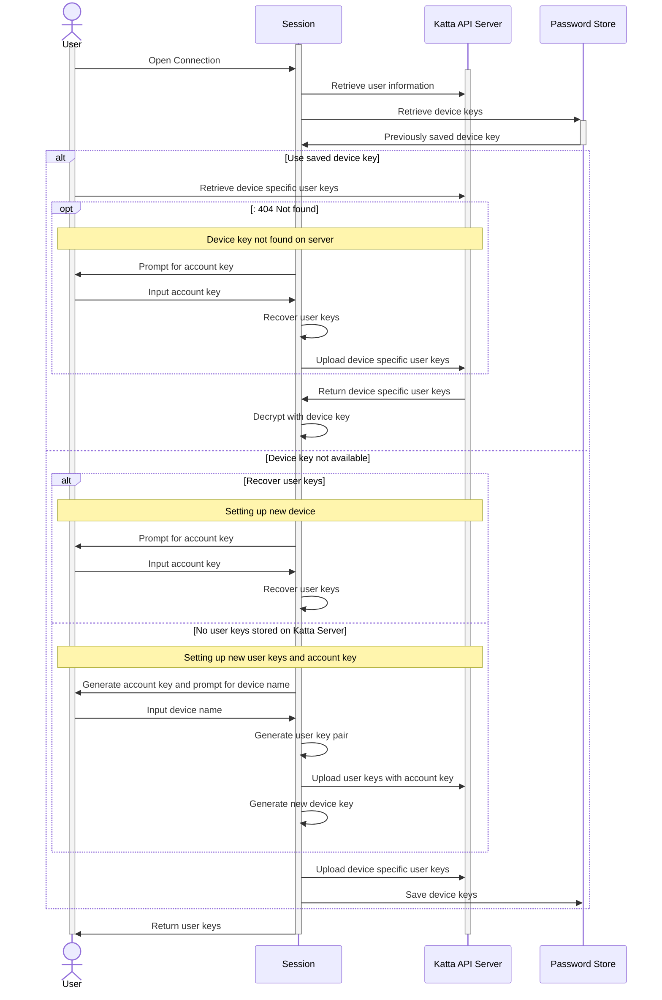
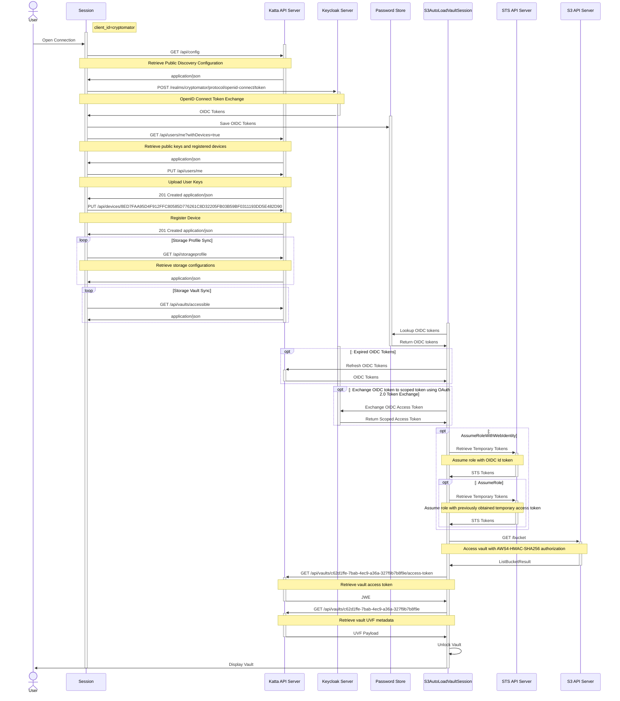

[](https://github.com/shift7-ch/katta-clientlib/actions/workflows/build.yml)

# Katta: the secure and easy way to work in teams

Katta bring zero-config storage management and zero-knowledge key management for teams and organizations.

## Katta Client Library

This library implements the [Katta Server API](https://github.com/shift7-ch/katta-docs/blob/main/OVERVIEW.md)
as [Cyberduck](https://github.com/iterate-ch/cyberduck) protocol features
for the Katta Client.

Features:

* Client code is generated for Katta Backend API through `openapi.json`
* Katta Server interaction (workflows like first login, vault creation, (automatic) access grant and sync of storage profiles and vaults): implementation and
  integration/regression tests.
* `S3` and `S3STS` Cyberduck protocols for Katta (see [Katta S3 Modes](https://github.com/shift7-ch/katta-docs/blob/main/OVERVIEW.md#katta-s3-modes)) incl.
  token exchange and AWS role chaining. Cyberduck handles OAuth 2.0 token management (authorization code grant and token refresh).

## One-Stop Shop Demo with Docker Compose

```bash
docker compose -f hub/src/test/resources/docker-compose-minio-localhost-hub.yml --profile local up -d
docker compose -f hub/src/test/resources/docker-compose-minio-localhost-hub.yml --profile local down
```

### Architecture

The following diagram shows the docker services:

````mermaid
architecture-beta
group dockernetwork(internet)[Docker Network]

service miniosetup(server)[MinIO setup] in dockernetwork
service minio(server)[MinIO] in dockernetwork
service keycloak(server)[Keycloak] in dockernetwork
service kattaweb(server)[Katta Web] in dockernetwork
service kattaserver(server)[Katta Server] in dockernetwork
service kattaserversetup(server)[Katta Server Setup] in dockernetwork
service postgres(database)[postgres] in dockernetwork
miniosetup:B --> T:minio
minio:R --> L:keycloak
kattaserver:T --> B:keycloak
kattaweb:R --> L:kattaserver
kattaserversetup:T --> B:kattaserver
kattaserver:R --> L:postgres
````

### Users

| User         | Password     | Katta Roles (`realmRoles`) | Keycloak Roles (`realm-management`)                            | MinIO Roles       |
|--------------|--------------|----------------------------|----------------------------------------------------------------|-------------------|
| `admin`      | `admin`      | `admin`                    | `realm-admin`                                                  |                   |
| `alice`      | `asd`        | `user`, `create-vaults`    |                                                                |                   |
| `bob`        | `asd`        | `user`, `create-vaults`    |                                                                |                   |
| `carol`      | `asd`        | `user`                     |                                                                |                   |
| `carol`      | `asd`        | `user`                     |                                                                |                   |
| `erin`       | `asd`        | `user`                     |                                                                |                   |
| `syncer`     | `asd`        | `syncer`                   | `view-users`, `view-clients`, `manage-users`, `manage-clients` |                   |
| `minioadmin` | `minioadmin` |                            |                                                                | `MINIO_ROOT_USER` |

### Endpoints

| Component       | URL                                  | Discovery                                                                |   |
|-----------------|--------------------------------------|--------------------------------------------------------------------------|---|
| Katta Web       | http://localhost:8080                | http://localhost:8080/api/config                                         |   |
| Keycloak        | http://keycloak:8081                 | http://keycloak:8180/realms/cryptomator/.well-known/openid-configuration |   |
| Swagger OpenAPI | http://localhost:8080/q/swagger-ui// | http://localhost:8080//q/openapi.json                                    |   |

You can use SecurityScheme (OAuth2, password)  with `client_id = cryptomatorhub` for Swagger UI.

## Flow to retrieve user keys



## Flow to authenticate and access vaults


