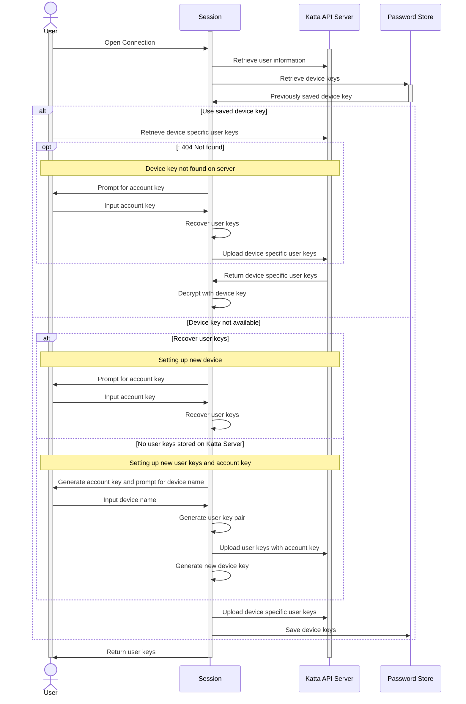

# Katta: the secure and easy way to work in teams

Katta bring zero-config storage management and zero-knowledge key management for teams and organizations.

## Katta Client Library

This library implements the [Katta Server API](https://github.com/shift7-ch/katta-docs/blob/main/OVERVIEW.md)
as [Cyberduck](https://github.com/iterate-ch/cyberduck) protocol features
for the Katta Client.

Features:

* Client code is generated for Katta Backend API through `openapi.json`
* Katta Server interaction (workflows like first login, vault creation, (automatic) access grant and sync of storage profiles and vaults): implementation and
  integration/regression tests.
* `S3` and `S3STS` Cyberduck protocols for Katta (see [Katta S3 Modes](https://github.com/shift7-ch/katta-docs/blob/main/OVERVIEW.md#katta-s3-modes)) incl.
  token exchange and AWS role chaining. Cyberduck handles OAuth 2.0 token management (authorization code grant and token refresh).

## Flow to retrieve user keys

