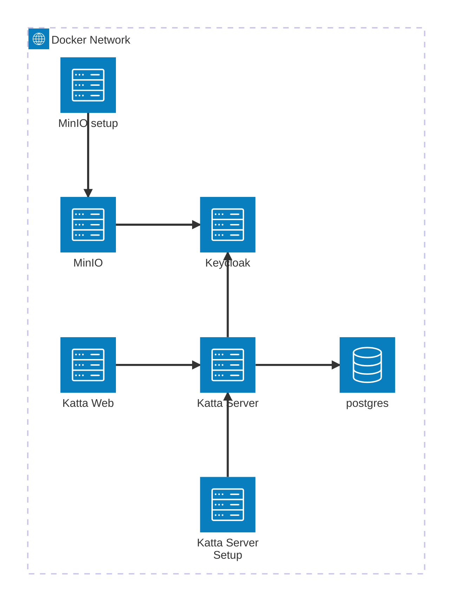

[](https://github.com/shift7-ch/katta-clientlib/actions/workflows/build.yml)
[](https://github.com/shift7-ch/katta-clientlib/actions/workflows/integration.yml)

# Katta: the secure and easy way to work in teams

Katta bring zero-config storage management and zero-knowledge key management for teams and organizations.

## Katta Client Library

This library implements the [Katta Server API](https://github.com/shift7-ch/katta-docs/blob/main/OVERVIEW.md)
as [Cyberduck](https://github.com/iterate-ch/cyberduck) protocol features
for the Katta Client.

Features:

* Client code is generated for Katta Backend API through `openapi.json`
* Katta Server interaction (workflows like first login, vault creation, (automatic) access grant and sync of storage profiles and vaults): implementation and
  integration/regression tests.
* `S3` and `S3STS` Cyberduck protocols for Katta (see [Katta S3 Modes](https://github.com/shift7-ch/katta-docs/blob/main/OVERVIEW.md#katta-s3-modes)) incl.
  token exchange and AWS role chaining. Cyberduck handles OAuth 2.0 token management (authorization code grant and token refresh).

## Dev Setup

In order to run the tests with debug logging, use

```shell
-Dlog4j.configurationFile=./hub/src/test/resources/log4j-test.xml
```

## One-Stop Shop Demo with Docker Compose

### Profiles

#### Local

Running full stack consisting of Katta Server, Keycloak and MinIO locally with Docker Compose.

```bash
docker compose -f test/src/test/resources/docker-compose-hub-keycloak-minio.yml --profile local --env-file test/src/test/resources/.local.env up --wait
docker compose -f test/src/test/resources/docker-compose-hub-keycloak-minio.yml --profile local down
```

#### Hybrid (testing)

For integration tests with deployed Keycloak, MinIO on `testing.katta.cloud` and AWS S3.

```bash
docker compose -f test/src/test/resources/docker-compose-hub-keycloak-minio.yml --profile hybrid --env-file test/src/test/resources/.chipotle.env up --wait
docker compose -f test/src/test/resources/docker-compose-hub-keycloak-minio.yml --profile hybrid down
```

#### Demo

Also deploys storage profiles for local MinIO (static+STS):

```
docker compose -f test/src/test/resources/docker-compose-hub-keycloak-minio.yml --profile demo --env-file test/src/test/resources/.local.env up --wait
docker compose -f test/src/test/resources/docker-compose-hub-keycloak-minio.yml --profile demo down
```

To access through desktop client, add [Katta Server.cyberduckprofile](test/src/test/resources/Katta Server.cyberduckprofile) to
`~/Library/Group Containers/KD9X6Y7KA2.cloud.katta.desktop/Library/Application Support/Katta/Profiles`.

### Users

| User         | Password     | Katta Roles (`realmRoles`) | Keycloak Roles (`realm-management`)                            | MinIO Roles       |
|--------------|--------------|----------------------------|----------------------------------------------------------------|-------------------|
| `admin`      | `admin`      | `admin`                    | `realm-admin`                                                  |                   |
| `alice`      | `asd`        | `user`, `create-vaults`    |                                                                |                   |
| `bob`        | `asd`        | `user`, `create-vaults`    |                                                                |                   |
| `carol`      | `asd`        | `user`                     |                                                                |                   |
| `carol`      | `asd`        | `user`                     |                                                                |                   |
| `erin`       | `asd`        | `user`                     |                                                                |                   |
| `syncer`     | `asd`        | `syncer`                   | `view-users`, `view-clients`, `manage-users`, `manage-clients` |                   |
| `minioadmin` | `minioadmin` |                            |                                                                | `MINIO_ROOT_USER` |

### Endpoints

| Component       | URL                                             | Discovery                                                                                                                                              |
|-----------------|-------------------------------------------------|--------------------------------------------------------------------------------------------------------------------------------------------------------|
| Katta Web       | http://localhost:8280                           | http://localhost:8280/api/config                                                                                                                       |
| Keycloak        | http://localhost:8380  / https://localhost:8443 | http://localhost:8380/realms/cryptomator/.well-known/openid-configuration / https://localhost:8443/realms/cryptomator/.well-known/openid-configuration |
| MinIO Console   | http://localhost:9101                           |                                                                                                                                                        |
| Swagger OpenAPI | http://localhost:8280/q/swagger-ui/             | http://localhost:8280/q/openapi.json                                                                                                                   |

You can use SecurityScheme (OAuth2, password)  with `client_id = cryptomatorhub` for Swagger UI.

### Architecture

The following diagram shows the docker services:


```mermaid
architecture-beta
group dockernetwork(internet)[Docker Network]

service miniosetup(server)[MinIO setup] in dockernetwork
service minio(server)[MinIO] in dockernetwork
service keycloak(server)[Keycloak] in dockernetwork
service kattaweb(server)[Katta Web] in dockernetwork
service kattaserver(server)[Katta Server] in dockernetwork
service kattaserversetup(server)[Katta Server Setup] in dockernetwork
service postgres(database)[postgres] in dockernetwork
miniosetup:B --> T:minio
minio:R --> L:keycloak
kattaserver:T --> B:keycloak
kattaweb:R --> L:kattaserver
kattaserversetup:T --> B:kattaserver
kattaserver:R --> L:postgres
```
