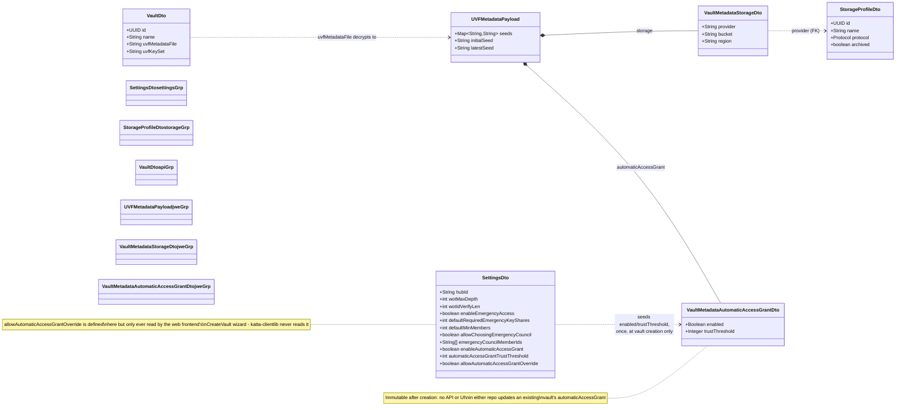
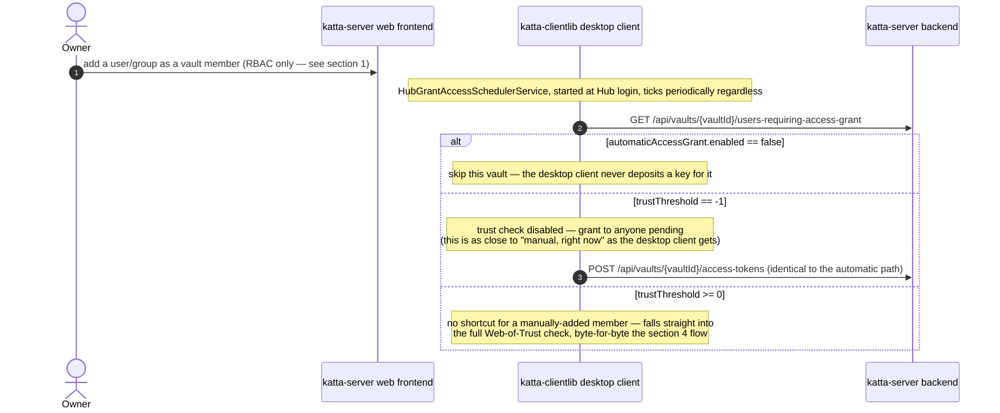

# Vault Access Grant

How a vault's member key gets deposited for a new member — manually (an owner explicitly acts) or automatically (via Web-of-Trust verification) — across *
*katta-clientlib** (desktop) and **katta-server** ("Hub" — backend + web frontend), plus the settings/defaults data model that governs it.

> **Scope note.** katta-server is a separate repo ([shift7-ch/katta-server](https://github.com/shift7-ch/katta-server), verified at commit `1e50912`).
> Everything below is read directly from source in both repos, not inferred.

> [!CAUTION]
> AI-generated content, manually skimmed.

## Contents

- [Settings, storage profiles, and vault metadata](#settings-storage-profiles-and-vault-metadata)
- **Manual access grant**
    - [1. Manual access grant — web frontend](#1-manual-access-grant--web-frontend)
    - [2. Manual access grant — desktop client](#2-manual-access-grant--desktop-client)
- **Automatic access grant**
    - [3. Automatic access grant — web frontend](#3-automatic-access-grant--web-frontend)
    - [4. Automatic access grant — desktop client](#4-automatic-access-grant--desktop-client)
- [Client comparison: desktop vs. web frontend](#client-comparison-desktop-vs-web-frontend)
    - [One mechanism vs. two](#one-mechanism-vs-two)
    - [Fidelity to the reference implementation](#fidelity-to-the-reference-implementation)
    - [Do both clients start new vaults with the same defaults?](#do-both-clients-start-new-vaults-with-the-same-defaults)

## The crux finding

The web frontend implements manual and automatic grant as **two separate, independently-triggered mechanisms**. The desktop client implements **only one** —
its "automatic access grant" background job is the *only* code path in `katta-clientlib` that ever deposits a vault key for another user, whether or not a human
ever intended anything to be "automatic" about it. See [Client comparison](#client-comparison-desktop-vs-web-frontend) for what that means in practice.

## Settings, storage profiles, and vault metadata

Membership permission (RBAC — who is *allowed* to be a member) and key material (the encrypted vault key actually delivered) are separate things, granted
through separate calls. Whether a key gets deposited automatically is governed by a per-vault flag that's seeded once, at vault-creation time, from a hub-wide
default — and never consulted again after that.

(Colors match [`vault_data_model.md`](vault_data_model.md)'s domain groups — violet is the one new group here, for hub-wide settings.)

**The overriding mechanism, precisely:** at vault-creation time, `CreateVault.vue` fetches `GET /settings` and uses `enableAutomaticAccessGrant`/
`automaticAccessGrantTrustThreshold` as the initial values for the new vault. If the hub-wide `allowAutomaticAccessGrantOverride` is `true`, the wizard shows an
extra step letting *this vault's creator* pick different values before they're encrypted into `vault.uvf`. After that one write, the hub-wide `Settings` row has
**zero further effect** — every grant decision for that vault reads only its own encrypted metadata, confirmed by both a backend Javadoc ("the server cannot see
them... evaluated client-side") and a frontend code comment ("An evil DB admin therefore cannot lower the bar"). The desktop client fetches the same
`SettingsDto` at vault-creation time to seed `VaultMetadataAutomaticAccessGrantDto` identically — but never reads `allowAutomaticAccessGrantOverride` at all,
since it has no vault-creation wizard step to gate.

## 1. Manual access grant — web frontend

No trust check at all. An owner can grant anyone access immediately, regardless of the vault's `automaticAccessGrant` settings.

```mermaid
sequenceDiagram
    autonumber
    actor Owner
    participant Web as katta-server web frontend (Vue 3)
    participant HubBackend as katta-server backend
    Owner ->> Web: search for a user or group, click "Add"
    Web ->> HubBackend: PUT /vaults/{vaultId}/users/{userId} (or /groups/{groupId})<br/>— RBAC membership only, no key yet
    Web ->> HubBackend: GET /vaults/{vaultId}/users-requiring-access-grant
    HubBackend -->> Web: pending users (a group is expanded to its individual members)
    Owner ->> Web: open "Grant access" dialog, review, confirm
    Note over Web: per pending user: encryptForUser(ecdhPublicKey, includeOwnerKeys)<br/>→ ECDH-ES JWE wrapping the MemberKey (+ RecoveryKey private bytes, only if granting OWNER)
    Web ->> HubBackend: POST /vaults/{vaultId}/access-tokens {userId: jwe, ...}
    HubBackend ->> HubBackend: persist AccessToken rows&#59; log VaultAccessGranted(automatic=false)
```

## 2. Manual access grant — desktop client

**There is no distinct manual path in this codebase.** No production class in `katta-clientlib` calls the RBAC membership endpoints (
`PUT /vaults/{vaultId}/users/{userId}`/`groups/{groupId}`) — adding a user or group to a vault's membership is done through the web frontend regardless of which
client eventually deposits the key. What the desktop client *does* have — a periodic background job — is the only thing in this repo capable of depositing the
key, and it always runs the same trust check described in [section 4](#4-automatic-access-grant--desktop-client).

## 3. Automatic access grant — web frontend

`AutomaticAccessGrantAgent.vue` is a renderless component, explicitly documented in its own source as "the reference implementation of the automatic access
grant client protocol... alternative clients (desktop, mobile, CLI) can be modelled after the flow below."

```mermaid
sequenceDiagram
    autonumber
    participant Web as katta-server web frontend (AutomaticAccessGrantAgent)
    participant HubBackend as katta-server backend

    loop background long-poll
        Web ->> HubBackend: GET /vaults/users-requiring-access-grant?wait=25
        HubBackend -->> Web: {vaultId: [userId, ...], ...}
    end
    Web ->> HubBackend: fetch and decrypt this vault's access token + vault.uvf
    Note over Web: read automaticAccessGrant.enabled/trustThreshold straight from the decrypted UVF metadata
alt not enabled
Note over Web: disqualify this vault permanently for the session
else enabled
loop each candidate user
Web->>HubBackend: GET /users/trusted/{userId} → signatureChain
Note over Web: wot.verify() walks the ES384 JWT chain from my own ECDSA key<br/>to the candidate's claimed public keys
alt trustThreshold == -1, or chain verifies and length <= trustThreshold
Note over Web: candidate is trusted
else
Note over Web: skip candidate
end
end
Note over Web: encryptForUser(ecdhPublicKey) per trusted candidate<br/>→ ECDH-ES JWE, member role only (never owner/recovery key)
Web->>HubBackend: POST /vaults/{vaultId}/access-tokens/auto {userId: jwe, ...}
HubBackend->>HubBackend: reject any candidate not genuinely pending&#59; persist&#59; log VaultAccessGranted(automatic=true)
end
```

## 4. Automatic access grant — desktop client

Structurally the same protocol as section 3, implemented independently in Java — but using an older, per-vault polling shape rather than the newer global
long-poll/`…/auto` pair (both exist in the OpenAPI spec; only the older shape is wired up here).

```mermaid
sequenceDiagram
    autonumber
    participant Desktop as katta-clientlib desktop client
    participant HubBackend as katta-server backend
    Note over Desktop: HubGrantAccessSchedulerService starts at HubSession.login(), ticks on a fixed period
loop every scheduler period
Desktop->>HubBackend: GET /api/vaults/accessible?role=OWNER
HubBackend-->>Desktop: owned, non-archived vaults
loop each owned vault
Desktop->>HubBackend: GET /api/vaults/{vaultId}/uvf/vault.uvf
Note over Desktop: decrypt locally → read automaticAccessGrant.enabled/trustThreshold
alt not enabled
Note over Desktop: skip vault
else enabled
Desktop->>HubBackend: GET /api/vaults/{vaultId}/users-requiring-access-grant
HubBackend-->>Desktop: pending users (individual, even if added via a group)
loop each candidate
Desktop->>HubBackend: GET /api/users/trusted
Note over Desktop: WoT.verifyRecursive walks the ES384 signature chain&#59;<br/>trust level = verified chain length
alt trustThreshold < 0, or trustLevel <= trustThreshold
Note over Desktop: candidate is trusted
else
Note over Desktop: skip candidate
end
end
Note over Desktop: encryptForUser(ecdhPublicKey) per trusted candidate → ECDH-ES JWE
Desktop->>HubBackend: POST /api/vaults/{vaultId}/access-tokens {userId: jwe, ...}
end
end
end
```

## Client comparison: desktop vs. web frontend

How the two clients' grant implementations stack up against each other and against the web frontend's self-declared reference protocol — mechanism count,
protocol fidelity, and creation-time defaults.

### One mechanism vs. two

| Component          | Instant, no-trust-check grant                     | Background, WoT-gated grant                                                                               | Trigger                                                                 |
|--------------------|---------------------------------------------------|-----------------------------------------------------------------------------------------------------------|-------------------------------------------------------------------------|
| **Web frontend**   | Yes — `GrantPermissionDialog.vue`                 | Yes — `AutomaticAccessGrantAgent.vue`                                                                     | Two independent code paths                                              |
| **Desktop client** | **No** — no such path exists                      | Yes — `GrantAccessServiceImpl` via `HubGrantAccessSchedulerService`                                       | One code path, always trust-gated                                       |
| **Hub backend**    | `POST .../access-tokens` (logs `automatic=false`) | `POST .../access-tokens/auto` (also cross-checks candidates are genuinely pending; logs `automatic=true`) | Never runs its own WoT check — it trusts whichever client made the call |

A vault owner using only the desktop client cannot instantly grant a specific pending member the way `GrantPermissionDialog.vue` lets a web user do — their only
options are to set the vault's `trustThreshold` to `-1` (grant to anyone, on the next scheduler tick) or wait for a genuine trust chain to form. The web
frontend's own source describes itself as the reference implementation other clients "can be modelled after" — the desktop client mirrors its automatic-grant
protocol closely, but never grew an equivalent to its separate manual dialog.

### Fidelity to the reference implementation

`AutomaticAccessGrantAgent.vue` names itself the reference implementation for the automatic-grant *client protocol* specifically — not for grant-granting as a
whole. Checked against that scope, the desktop client is a faithful, independent reimplementation with one structural gap and one smaller drift:

**Matches exactly:**

- **Trust model.** Both walk the same chain of ES384-signed JWTs (`TrustedUserDto.signatureChain`) from the caller's own ECDSA key to the candidate's claimed
  public keys, and both treat trust level as the verified chain length compared against `trustThreshold`.
- **Escape hatch.** Both treat `trustThreshold == -1` identically: skip the trust check, grant to anyone pending.
- **Grant crypto.** Both produce the same artifact — an ECDH-ES JWE (`org.cryptomator.hub.userkey`) wrapping the vault's `MemberKey` — via each language's own
  `encryptForUser`/`AccessTokenProducing` implementation, then `POST` it to the Hub.
- **Gating source.** Both read `automaticAccessGrant.enabled`/`trustThreshold` exclusively from the vault's own decrypted UVF metadata, never from the hub-wide
  `/settings` default (which is only ever a one-time seed at vault creation —
  see [Settings, storage profiles, and vault metadata](#settings-storage-profiles-and-vault-metadata)).

**Diverges:**

- **Missing mechanism, not missing fidelity.** The gap isn't that the desktop client implements automatic grant incorrectly — it's that it never grew the
  *separate*, no-trust-check manual mechanism the web frontend has (`GrantPermissionDialog.vue`). See the table above.
- **Older endpoint shape.** The desktop client still polls the older, per-vault surface (`GET /vaults/{vaultId}/users-requiring-access-grant` + generic
  `POST .../access-tokens`) instead of the newer global long-poll (`GET /vaults/users-requiring-access-grant?wait=`) and dedicated `POST .../access-tokens/auto`
  that the web frontend uses — both already exist in the OpenAPI spec, so this is unused surface rather than a missing feature, but it means the desktop client
  polls per-vault on a fixed scheduler period instead of blocking on a single global long-poll.

### Do both clients start new vaults with the same defaults?

Yes, in the sense that matters most — both source the *value* from the same place at the same moment — but only one of them lets a creator deviate from it.

- **Same source of truth.** Desktop (`HubUVFVaultProvider.create()` → `HubStorageLocationService.toPayload()`) and the web frontend (`CreateVault.vue`) both
  call the identical endpoint — `GET /api/settings` / `GET /settings` — and seed the new vault's `automaticAccessGrant.enabled`/`trustThreshold` straight from
  `SettingsDto.enableAutomaticAccessGrant`/`automaticAccessGrantTrustThreshold`. Neither client hardcodes its own default; both defer to the same hub-wide
  singleton `Settings` row, whatever an admin has currently set it to via `PUT /settings`.
- **Shipped initial values** (`V30__Automatic_Access_Grant.sql`): `enableAutomaticAccessGrant = false`, `automaticAccessGrantTrustThreshold = 0`,
  `allowAutomaticAccessGrantOverride = false` — automatic grant is off by default on a fresh Hub deployment, until an admin opts in.
- **The override step only exists on the web.** The web frontend also reads `allowAutomaticAccessGrantOverride`; when `true`, `CreateVault.vue` shows an extra
  wizard step letting *this vault's creator* pick different `enabled`/`trustThreshold` values before they're encrypted into the vault's metadata — so a
  web-created vault's persisted value can legitimately diverge from the hub-wide default. The desktop client **never reads `allowAutomaticAccessGrantOverride`
  at all** (confirmed dead/unread in production code) — it has no override step and surfaces nothing to the user during vault creation; it always persists the
  raw hub-wide default, silently and verbatim.
- **Net effect:** a vault created by either client the moment before an admin changes `/settings` gets the old value; the moment after, both get the new value —
  they never disagree with each other or with the server. The only way a specific vault's value differs from the hub-wide default is if it was created via the
  web frontend with the override step exercised.

## Sources

From `/Users/che/workspaces/katta-clientlib` (this repo):

- `hub/src/main/resources/openapi.json` — `SettingsDto` schema, `GET`/`PUT /api/settings`, vault access-grant endpoints
- `hub/src/main/java/cloud/katta/crypto/uvf/VaultMetadataAutomaticAccessGrantDto.java`, `UVFMetadataPayload.java` — per-vault override fields
- `hub/src/main/java/cloud/katta/protocols/hub/HubStorageLocationService.java` — `toPayload(...)` seeding the override from `SettingsDto` at creation
- `hub/src/main/java/cloud/katta/protocols/hub/HubUVFVaultProvider.java` — fetches `SettingsDto`; inline self-grant at vault creation
- `hub/src/main/java/cloud/katta/workflows/GrantAccessServiceImpl.java` — the sole key-deposit mechanism in this repo
- `hub/src/main/java/cloud/katta/protocols/hub/HubGrantAccessSchedulerService.java` — periodic scheduler, started/stopped in `HubSession`
- `hub/src/main/java/cloud/katta/workflows/WoTServiceImpl.java`, `hub/src/main/java/cloud/katta/crypto/wot/WoT.java` — trust-chain verification
- `hub/src/test/java/cloud/katta/workflows/AbstractHubWorkflowTest.java`, `AbstractHubWorkflowGroupTest.java` — RBAC endpoints only exercised in tests

From [shift7-ch/katta-server](https://github.com/shift7-ch/katta-server) (commit `1e50912`):

- `backend/src/main/java/org/cryptomator/hub/entities/Settings.java`, `flyway/V30__Automatic_Access_Grant.sql` — settings entity and default values
- `backend/src/main/java/org/cryptomator/hub/api/SettingsResource.java` — `GET`/`PUT /settings`, role gating, audit logging
- `backend/src/main/java/org/cryptomator/hub/api/VaultResource.java` — `addUser`/`addGroup`, `grantAccess`, `autoGrantAccess`, `getUsersRequiringAccessGrant` (
  both variants)
- `frontend/src/components/VaultDetails.vue`, `GrantPermissionDialog.vue` — manual grant UI and encryption logic
- `frontend/src/components/CreateVault.vue` — settings-seeding and the creator-override wizard step
- `frontend/src/components/AutomaticAccessGrantAgent.vue`, `frontend/src/common/wot.ts` — the reference automatic-grant client protocol
- `frontend/src/common/crypto.ts`, `universalVaultFormat.ts` — `encryptForUser`/`AccessTokenProducing`
