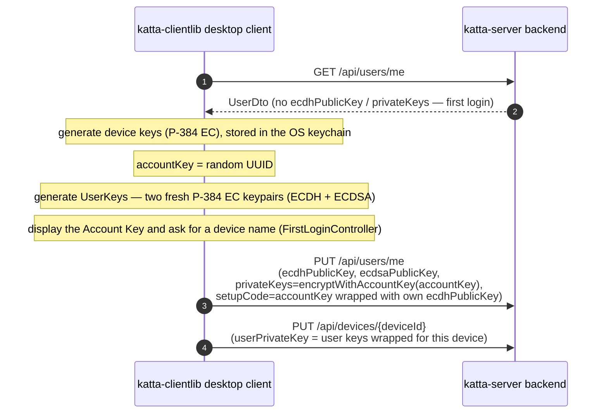
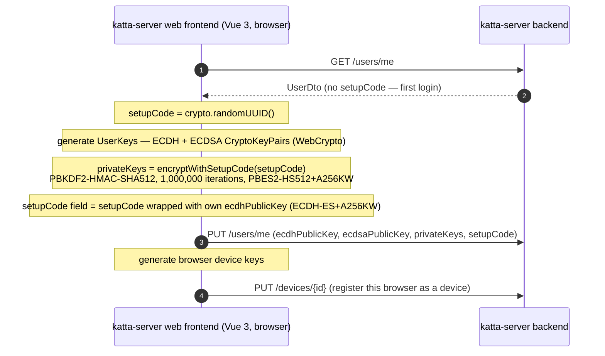
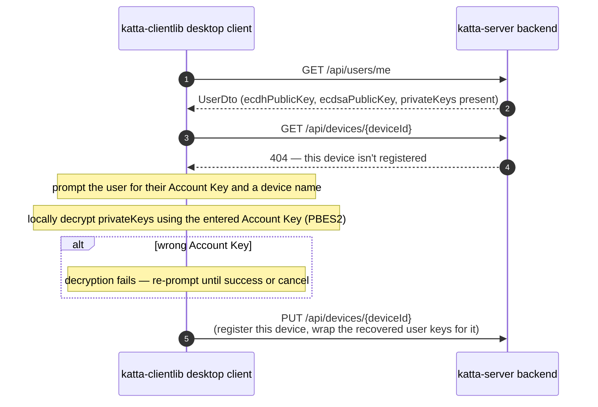
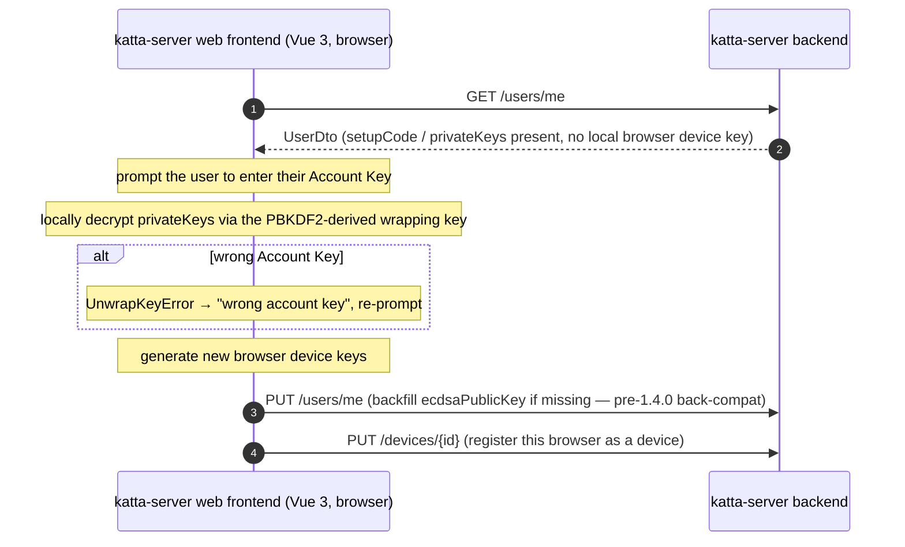
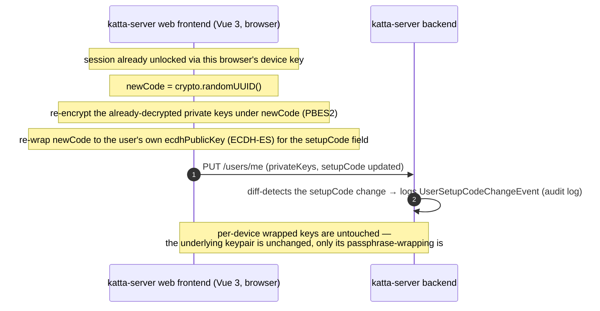

# Account Key Interactions

How the per-user **Account Key** (server-side field name: `setupCode`) is created, used for recovery, and rotated across **katta-clientlib** (desktop) and *
*katta-server** ("Hub" — backend + web frontend).

> **Scope note.** katta-server is a separate repo ([shift7-ch/katta-server](https://github.com/shift7-ch/katta-server), verified at commit `1e50912`).
> Everything below is read directly from source in both repos, not inferred. The JWE formats and key identifiers (`org.cryptomator.hub.setupCode`,
`org.cryptomator.hub.userkey`) are byte-for-byte identical between the Java desktop client and the TypeScript web frontend, so a backup created on one can be
> recovered on the other.

> [!CAUTION]
> AI-generated content, manually skimmed.

## Contents

- **Creation**
    - [1. Creation — desktop client](#1-creation--desktop-client)
    - [2. Creation — web frontend](#2-creation--web-frontend)
- **Usage & recovery**
    - [3. Usage and recovery — desktop client (new or lost device)](#3-usage-and-recovery--desktop-client-new-or-lost-device)
    - [4. Usage and recovery — web frontend (new browser)](#4-usage-and-recovery--web-frontend-new-browser)
- **Rotation**
    - [5. Rotation — web frontend only (Regenerate Account Key)](#5-rotation--web-frontend-only-regenerate-account-key)
- [Related but distinct mechanisms](#related-but-distinct-mechanisms)

## What the Account Key actually is

It's a **randomly generated UUID**, not a user-chosen passphrase — despite the UI language ("Account Key") suggesting the latter. It's used as the password
input to a standard JOSE PBES2 key derivation (PBKDF2-HMAC-SHA512, 1,000,000 iterations by default, wrapping an AES-256 key — RFC 7518 §4.8,
`alg=PBES2-HS512+A256KW`), which wraps the user's ECDH+ECDSA private keys for server-side backup. But that PBES2-wrapped backup isn't the only hub-side copy of
those private keys — both codebases also stash one ECDH-ES-wrapped copy per registered device, so a device doesn't need the Account Key at all once it's already
paired:

| Field                   | Contents                                                                                  | Stored hub-side?         | Stored client-side (keychain)?                                                                     | Encrypted at rest by                  | JWE algorithm        |
|-------------------------|-------------------------------------------------------------------------------------------|--------------------------|----------------------------------------------------------------------------------------------------|---------------------------------------|----------------------|
| `User.privateKeys`      | The user's ECDH + ECDSA private keys — the recovery-only backup copy                      | Yes                      | No — fetched from the server on demand, never persisted in the OS keychain                         | The Account Key itself                | `PBES2-HS512+A256KW` |
| `User.setupCode`        | The plaintext Account Key string, wrapped with the user's own public key                  | Yes                      | No — same, fetched on demand                                                                       | The user's own ECDH public key        | `ECDH-ES+A256KW`     |
| `Device.userPrivateKey` | The *same* ECDH + ECDSA private keys — one row per registered device, the day-to-day copy | Yes — one row per device | No — still hub-side; only the device's *own* keypair (which unlocks this) lives in the OS keychain | That specific device's own public key | `ECDH-ES+A256KW`     |

`User.setupCode` exists purely so an already-unlocked session (via a registered device key) can redisplay the Account Key later — the server never derives or
sees the plaintext value itself, only these ciphertexts. `Device.userPrivateKey` exists so day-to-day unlock never has to touch the Account Key or its PBES2
KDF (1,000,000 PBKDF2 iterations is deliberately slow) — the Account Key is consulted only once, at pairing time, or later during recovery on a *new* device
that has no `Device.userPrivateKey` row yet.

Each JWE also carries a `kid` (key ID) header naming *what* it's encrypted with, not which field it lives in — worth spelling out since one collides confusingly
with a field name: the **`User.privateKeys`** JWE's kid is `org.cryptomator.hub.setupCode` (because it's unlocked *using* the setup code / Account Key — this is
not a reference to the `User.setupCode` row above it), the **`User.setupCode`** JWE's kid is `org.cryptomator.hub.userkey` (unlocked using the user's own key),
and the **`Device.userPrivateKey`** JWE's kid is `org.cryptomator.hub.deviceKey` (unlocked using that device's key, via `UserKeys.encryptForDevice()`).

None of these three rows is ever stored client-side — all three round-trip through the server on every use. The one secret that *is* genuinely keychain-resident
and never uploaded is the **Device Key** itself (per device, an EC keypair) — only its public half reaches the server (`DeviceDto.publicKey`); its private half
is what decrypts the `Device.userPrivateKey` row above. See [Creation — desktop client](#1-creation--desktop-client) for where that fits in.

## Component summary

| Component                              | Create?                                                                  | Use / recover?                                         | Rotate?                                                                                 | Notes                                                                     |
|----------------------------------------|--------------------------------------------------------------------------|--------------------------------------------------------|-----------------------------------------------------------------------------------------|---------------------------------------------------------------------------|
| **Desktop client** (katta-clientlib)   | Yes — `HubSession.login()` → `UserKeysServiceImpl.getOrCreateUserKeys()` | Yes — same method, recovery branch on device-not-found | **No** — no rotate/change method anywhere in `UserKeysService` or `DeviceSetupCallback` | `cloud.katta.crypto.UserKeys`/`JWE` (Nimbus JOSE)                         |
| **Web frontend** (katta-server, Vue 3) | Yes — `InitialSetup.vue`, `State.CreateUserKey`                          | Yes — `InitialSetup.vue`, `State.RecoverUserKey`       | **Yes** — `RegenerateSetupCodeDialog.vue`                                               | `frontend/src/common/crypto.ts`/`jwe.ts` (WebCrypto)                      |
| **Hub backend** (katta-server)         | Stores opaque JWEs via `PUT /users/me`                                   | Same endpoint serves `GET`/`PUT /users/me`             | Same endpoint — diff-detected and audit-logged                                          | Never derives or sees the plaintext Account Key; see `UsersResource.java` |

## 1. Creation — desktop client

Account Key + user keys are generated only on a true first login — when the server has no `ecdhPublicKey`/`privateKeys` for this user at all.

## 2. Creation — web frontend

## 3. Usage and recovery — desktop client (new or lost device)

Triggers when the user *does* have server-side keys, but `GET /api/devices/{deviceId}` for this device's own keychain key comes back 404 — i.e. this device was
never registered (or its keychain entry was lost).

## 4. Usage and recovery — web frontend (new browser)

## 5. Rotation — web frontend only (Regenerate Account Key)

`RegenerateSetupCodeDialog.vue` requires an already-unlocked session (private keys must already be decrypted via a registered browser device key) — you cannot
rotate the Account Key using only the old code from the recovery screen.

**The desktop client has no equivalent.** `UserKeysService` exposes only `getUserKeys(...)`/`getOrCreateUserKeys(...)`, and `DeviceSetupCallback` only one-shot
creation/recovery prompts — there is no rotate/regenerate method anywhere in `cloud.katta.workflows.*` or `cloud.katta.core.*`. Today, rotating an Account Key
requires the web frontend.

The closest thing to a backend "reset" is the destructive `POST /users/me/reset`, which wipes `ecdhPublicKey`/`ecdsaPublicKey`/`privateKeys`/`setupCode`
entirely and cascades deletion of devices, access tokens, and emergency-key-shares — forcing a brand-new first-login cycle rather than gracefully re-wrapping
existing keys. The desktop client's generated `apiUsersMeResetPost()` method exists but is never called anywhere in this repo.

## Related but distinct mechanisms

Two other subsystems also use the word "recovery" but are unrelated to the per-user Account Key — worth not conflating:

- **Vault Recovery Key** — a per-*vault*, word-encoded export of that vault's own masterkey (`DisplayRecoveryKeyDialog.vue`, `RecoveryKeyProducing` in
  `frontend/src/common/crypto.ts`). Purely client-side; nothing is stored server-side, and it has no interaction with `User.setupCode`/`privateKeys`.
- **Emergency Access / Council Recovery** — a per-*vault*, multi-party, threshold-style social recovery scheme (`EmergencyRecoveryProcess`,
  `EmergencyAccessResource`, `RecoveryProcessDto`/`RecoveredKeyShareDto` in the data model). Requires cooperation from other trusted vault members ("council")
  through a multi-step, server-tracked process — nothing to do with a single user's own passphrase-derived backup, beyond one coupling point: resetting your own
  account (`POST /users/me/reset`) also removes you as a council member from any vault's emergency-access scheme.

## Sources

From `/Users/che/workspaces/katta-clientlib` (this repo):

- `hub/src/main/java/cloud/katta/crypto/UserKeys.java` — `encryptWithAccountKey`/`recoverWithAccountKey`
- `hub/src/main/java/cloud/katta/crypto/JWE.java` — PBES2 constants (`PBES2_HS512_A256KW`, 1,000,000 iterations) and ECDH-ES helpers
- `hub/src/main/java/cloud/katta/crypto/AccountKeyPayload.java` — the `setupCode` JWE payload wrapper
- `hub/src/main/java/cloud/katta/workflows/UserKeysServiceImpl.java` — `getOrCreateUserKeys`, `recoverUserKeys`, `uploadUserKeys`, `uploadDeviceKeys`
- `hub/src/main/java/cloud/katta/protocols/hub/HubSession.java` — `login()`/`pair()` call chain
- `hub/src/main/java/cloud/katta/core/DeviceSetupCallback.java`, `DefaultDeviceSetupCallback.java` — account-key generation/prompt callbacks
- `osx/src/main/java/cloud/katta/controller/FirstLoginController.java`, `DeviceSetupController.java` — macOS UI
- `hub/src/test/java/cloud/katta/core/UserKeysRecoveryTest.java` — round-trip test proving the recovery path
- `hub/src/main/resources/openapi.json` — `UserDto.setupCode`/`privateKeys` schema, `POST /api/users/me/reset`

From [shift7-ch/katta-server](https://github.com/shift7-ch/katta-server) (commit `1e50912`):

- `backend/src/main/java/org/cryptomator/hub/entities/User.java`, `flyway/B28__Hub_1.5.0.sql` — `setupcode`/`privatekeys` columns
- `backend/src/main/java/org/cryptomator/hub/api/UsersResource.java` — `PUT/GET /users/me`, `POST /users/me/reset`
- `backend/src/main/java/org/cryptomator/hub/entities/events/UserSetupCodeChangeEvent.java` — audit event for rotation
- `frontend/src/components/InitialSetup.vue` — `State.CreateUserKey` / `State.RecoverUserKey`
- `frontend/src/components/RegenerateSetupCodeDialog.vue`, `ManageSetupCode.vue` — rotation UI
- `frontend/src/common/crypto.ts` — `UserKeys.create`/`encryptWithSetupCode`/`recover`
- `frontend/src/common/jwe.ts` — `PBES2.deriveWrappingKey` (PBKDF2-HMAC-SHA512 via WebCrypto)
- `frontend/src/common/userdata.ts` — `decryptUserKeysWithSetupCode`, `decryptSetupCode`, `decryptUserKeysWithBrowser`
- `backend/src/main/java/org/cryptomator/hub/entities/EmergencyRecoveryProcess.java`, `api/EmergencyAccessResource.java` — the unrelated vault-level
  council-recovery mechanism
