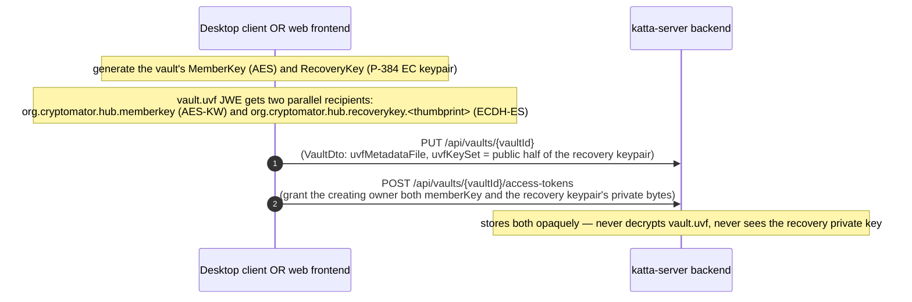
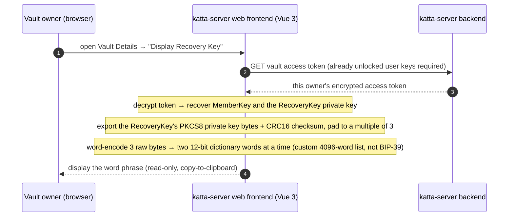
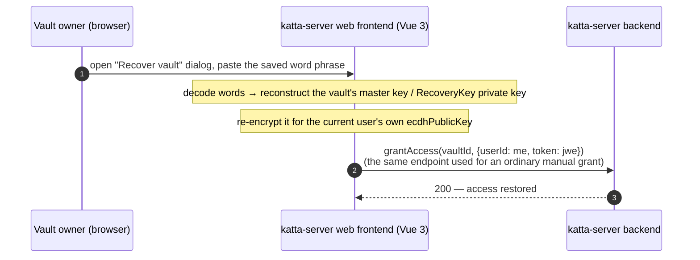

# Vault Recovery Key Interactions

How the per-**vault** word-encoded **Recovery Key** is created, used for recovery, and (not) rotated across **katta-clientlib** (desktop) and **katta-server
** ("Hub" — backend + web frontend).

> **Scope note.** katta-server is a separate repo ([shift7-ch/katta-server](https://github.com/shift7-ch/katta-server), verified at commit `1e50912`).
> Everything below is read directly from source in both repos, not inferred. **This is a different mechanism from the
per-user [Account Key](account_key_interactions.md)** (a randomly-generated recovery secret for your own identity keys) —
> see [Related but distinct mechanisms](#related-but-distinct-mechanisms).

> [!CAUTION]
> AI-generated content, manually skimmed.

## The crux finding

For UVF-format vaults, the word-encoded Vault Recovery Key is not a separate secret derived from anything — **it is the private half of the same P-384 keypair
already documented in [`data_model.md`](data_model.md) as the `org.cryptomator.hub.recoverykey.<thumbprint>` JWE recipient on `vault.uvf`**, just exported as
words instead of transported as raw bytes inside a server-mediated JWE. One secret, two encodings:

- **As raw bytes**, delivered automatically to whoever holds the `OWNER` role, inside their per-user `UVFAccessTokenPayload.recoveryKey` field —
  machine-to-machine, never seen by a human. Both the desktop client and the web frontend generate and distribute this at vault-creation time.
- **As words**, generated on demand by the web frontend from that same private key's PKCS8 bytes, for a human to write down and store offline. **Only the web
  frontend implements this encoding** — the desktop client has no word-based export or import anywhere in its source.

For the legacy `VaultFormat8` (pre-UVF) vaults the web frontend still supports, there's no keypair/JWE-recipient concept at all — the "recovery key" there is
simply the vault's raw 512-bit HMAC master key, exported directly.

## Contents

- **Creation**
    - [1. Recovery key material — created for every UVF vault (desktop and web)](#1-recovery-key-material--created-for-every-uvf-vault-desktop-and-web)
    - [2. Word-phrase export — web frontend only](#2-word-phrase-export--web-frontend-only)
- **Usage & recovery**
    - [3. Re-grant your own lost access — web frontend only](#3-re-grant-your-own-lost-access--web-frontend-only)
    - [4. Import an external vault as new — web frontend only](#4-import-an-external-vault-as-new--web-frontend-only)
- **Rotation**
    - [5. Rotation — not implemented anywhere](#5-rotation--not-implemented-anywhere)
- [Related but distinct mechanisms](#related-but-distinct-mechanisms)

## Component summary

| Component                              | Generates the keypair?                                                                                             | Exports/imports as words?                                                            | Rotates it?                |
|----------------------------------------|--------------------------------------------------------------------------------------------------------------------|--------------------------------------------------------------------------------------|----------------------------|
| **Desktop client** (katta-clientlib)   | Yes — `HubVaultKeys.create()` at vault creation                                                                    | **No** — no word encoder, no `RecoveryKeyFactory`-style interface anywhere in source | No                         |
| **Web frontend** (katta-server, Vue 3) | Yes — `RecoveryKey`/`VaultFormat8` at vault creation                                                               | Yes — custom 4096-word encoder (`util.ts`), not BIP-39                               | No — TODO placeholder only |
| **Hub backend** (katta-server)         | Stores the public half in `VaultDto.uvfKeySet`; delivers the private half inside opaque per-user access-token JWEs | Never sees the word phrase or raw key bytes                                          | —                          |

## 1. Recovery key material — created for every UVF vault (desktop and web)

This part happens identically regardless of which client creates the vault (see the fuller creation flows in [`s3_interactions.md`](s3_interactions.md)) — only
the recovery-key-specific slice is shown here.

The desktop client's `HubUVFVaultProvider.load()` only ever reconstructs `HubVaultKeys` from the access token's `key` (member key) field — nothing in this
repo's source was found consuming `UVFAccessTokenPayload.recoveryKey` afterwards, even though the client faithfully receives and could use it.

## 2. Word-phrase export — web frontend only

Gated to vault **owners**, and only once the vault's key material is already unwrapped in the browser (via the owner's own per-vault access token) — this is a
display feature, not an independent access path.

`DisplayRecoveryKeyDialog.vue` itself does no cryptography — encode/decode lives in `frontend/src/common/util.ts`'s `WordEncoder`, and the export logic lives on
the format classes (`RecoveryKey.createRecoveryKey()` for UVF, `VaultFormat8.createRecoveryKey()` for the legacy format).

## 3. Re-grant your own lost access — web frontend only

If an owner's own access token is missing or invalid (`ForbiddenError` when unwrapping vault keys), `VaultDetails.vue` offers a "Recover vault" action using a
previously-saved word phrase — this reuses the *ordinary* access-grant API, not a dedicated recovery endpoint.

**Known gap, called out in the source itself:** `RecoverVaultDialog.vue` has a literal `// TODO: check whether Vault Format 8 or UVF` — as written, it only
handles the legacy `VaultFormat8.recover()` path; the UVF branch isn't wired up in this dialog.

## 4. Import an external vault as new — web frontend only

The `vaults/recover` route renders `CreateVault` with `recover: true`. This doesn't restore access to an existing `VaultDto` — it creates a **brand-new** vault
record from someone else's exported vault files plus their recovery key.

```mermaid
sequenceDiagram
    autonumber
    participant User as User (browser)
    participant Web as katta-server web frontend (Vue 3)
    participant HubBackend as katta-server backend

    User->>Web: navigate to /vaults/recover
    User->>Web: paste the word phrase&#59; upload the vault's vault.uvf / vault.cryptomator file
    alt UVF
        Note over Web: decode words → RecoveryKey private key<br/>decrypt the uploaded vault.uvf via the recoverykey JWE recipient
        Note over Web: generate a brand-new MemberKey (the old one is unknown/irrelevant)
    else legacy VaultFormat8
        Note over Web: decode words → master key&#59; verify it signs the uploaded vault.cryptomator JWT
    end
    Note over Web: continue the normal vault-creation wizard (new vaultId, owner grant, etc.)
    Web->>HubBackend: create the vault as a new VaultDto (uvfKeySet includes the recovered public recovery key)
```

The backend has **zero** code referencing the word-phrase recovery key anywhere (`grep -rn "recoveryKey" backend/src/main/java` → no hits) — it only ever sees
the resulting re-encrypted access-grant token (case 3) or an ordinary new-vault-creation call (case 4), never the recovery key or word phrase itself.

## 5. Rotation — not implemented anywhere

Neither repo has any way to regenerate a vault's recovery keypair or advance the UVF format's seed material, despite the format structurally supporting it:

- `UVFMetadataPayload`/`VaultMetadata` carry a `seeds` map plus `initialSeed`/`latestSeed` markers specifically so a vault *could* rotate its active encryption
  key while retaining old seeds to decrypt older content — but `seeds` is populated with exactly one entry at creation in both the desktop client (
  `UVFMetadataPayload.create()`) and the web frontend (`VaultMetadata.create()`), and no method in either codebase ever adds a second seed or advances
  `latestSeed`.
- The web frontend has an explicit, honest placeholder for this: `VaultDetails.vue` contains `<!-- TODO: regenerateRecoveryKey button (UVF only) -->` directly
  in the template, unimplemented.
- A test in the desktop client named `KeyRotationTest` sounds relevant but isn't — it rotates a vault's *shared S3 storage credentials* (a `nickname`/access-key
  field), not any cryptographic seed or the recovery keypair.
- admin-cli has no recovery-key-related commands at all.

## Related but distinct mechanisms

- **[Account Key](account_key_interactions.md)** — a per-*user* (not per-vault) randomly-generated recovery secret for your own ECDH/ECDSA identity keys.
  Entirely separate JWE key IDs (`org.cryptomator.hub.setupCode`, `org.cryptomator.hub.userkey`) and entirely separate UI. Don't confuse a lost Account Key with
  a lost vault Recovery Key — recovering one does nothing for the other.
- **Emergency Access / Council Recovery** — a per-vault, multi-party, threshold scheme requiring cooperation from other trusted vault members through a
  server-tracked process (`EmergencyRecoveryProcess`, `RecoveryProcessDto`). It *reuses* the recovery key's raw bytes as the secret to Shamir-split among a
  council, but the multi-party protocol itself is unrelated to exporting/importing the key as words.
- **The `org.cryptomator.hub.recoverykey.<thumbprint>` JWE kid is not a third mechanism** — as established above, for UVF vaults it's the exact same P-384
  keypair as the word-phrase Recovery Key, just addressed by key ID when used as a JWE recipient instead of word-encoded for a human.

## Sources

From `/Users/che/workspaces/katta-clientlib` (this repo):

- `hub/src/main/java/cloud/katta/crypto/uvf/UVFMetadataPayload.java` — `seeds`/`initialSeed`/`latestSeed`, single-seed `create()`
- `hub/src/main/java/cloud/katta/crypto/uvf/UVFAccessTokenPayload.java` — `key`/`recoveryKey` fields delivered per-user
- `hub/src/main/java/cloud/katta/protocols/hub/HubVaultKeys.java` — `recoveryKey` (P384 EC keypair), JWE kid `org.cryptomator.hub.recoverykey.<thumbprint>`
- `hub/src/main/java/cloud/katta/protocols/hub/HubUVFVaultProvider.java` — vault-creation recovery-key generation and owner access-token grant; `load()`'s
  member-key-only reconstruction
- `hub/src/main/java/cloud/katta/protocols/hub/HubVaultMetadataUVFProvider.java` — generic `vault.uvf` JWKSet decryption, works against either recipient
- `hub/src/test/java/cloud/katta/protocols/hub/HubVaultMetadataUVFProviderTest.java` — proves the recovery-key JWE recipient decrypts the same blob as the
  member key
- `hub/src/test/java/cloud/katta/core/KeyRotationTest.java` — rotates storage credentials, not the recovery keypair (name is misleading)
- `admin-cli/src/main/java/cloud/katta/cli/commands/**` — confirmed no recovery-key-related commands

From [shift7-ch/katta-server](https://github.com/shift7-ch/katta-server) (commit `1e50912`):

- `frontend/src/components/VaultDetails.vue` — owner-gated "Display Recovery Key" trigger; `<!-- TODO: regenerateRecoveryKey button (UVF only) -->`
- `frontend/src/components/DisplayRecoveryKeyDialog.vue` — presentational display/copy dialog
- `frontend/src/components/RecoverVaultDialog.vue` — self re-grant flow; `// TODO: check whether Vault Format 8 or UVF`
- `frontend/src/components/CreateVault.vue` (`recover: true` state) — import-as-new-vault flow
- `frontend/src/router/index.ts` — `vaults/recover` route
- `frontend/src/common/crypto.ts` — `RecoveryKeyProducing` interface
- `frontend/src/common/universalVaultFormat.ts` — `RecoveryKey` class, `VaultMetadata.encrypt`/`decryptWithRecoveryKey`, single-seed `VaultMetadata.create()`
- `frontend/src/common/vaultFormat8.ts` — legacy format's raw-master-key recovery key
- `frontend/src/common/util.ts` — `WordEncoder`, `frontend/src/common/4096words_en.ts` dictionary
- `frontend/src/common/vaultKeys.ts` — `unwrapVaultKeys`, the owner-access-token prerequisite
- Backend: confirmed zero matches for `recoveryKey` anywhere in `backend/src/main/java`
