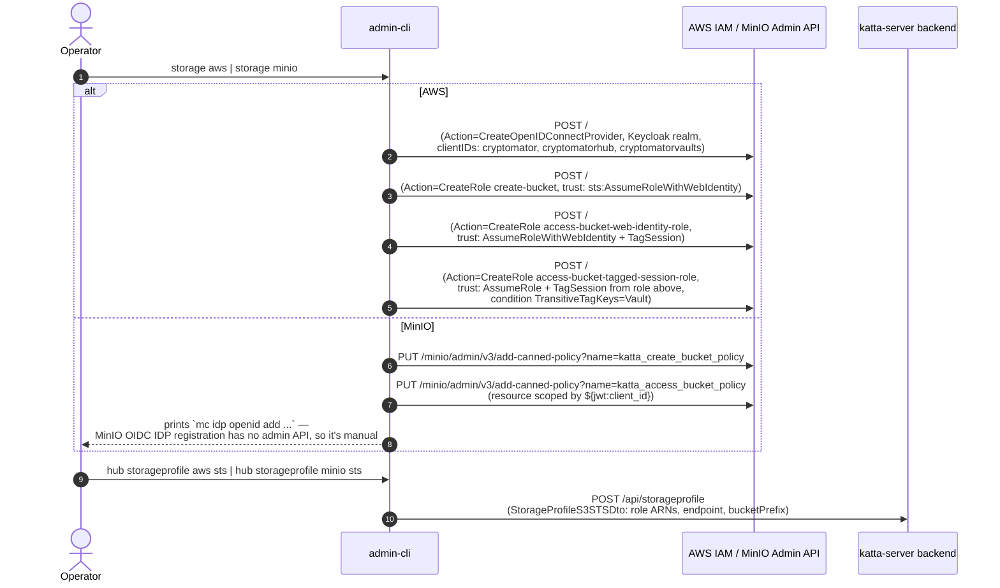
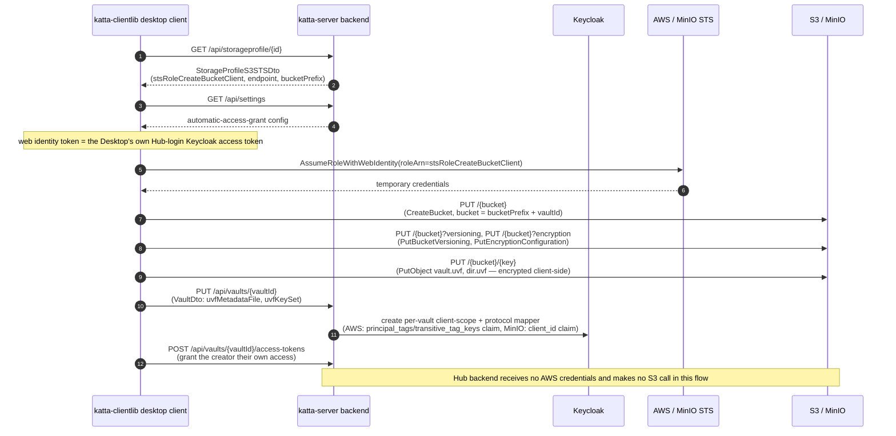
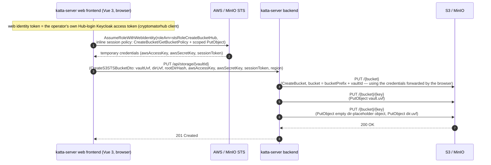
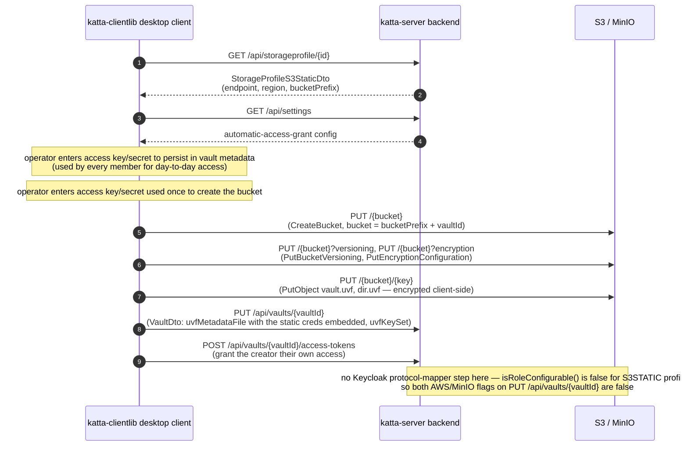
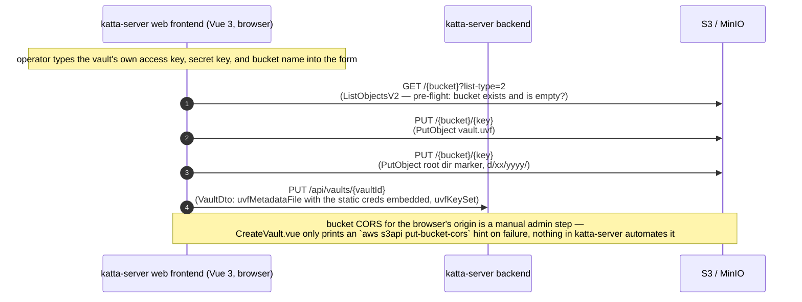
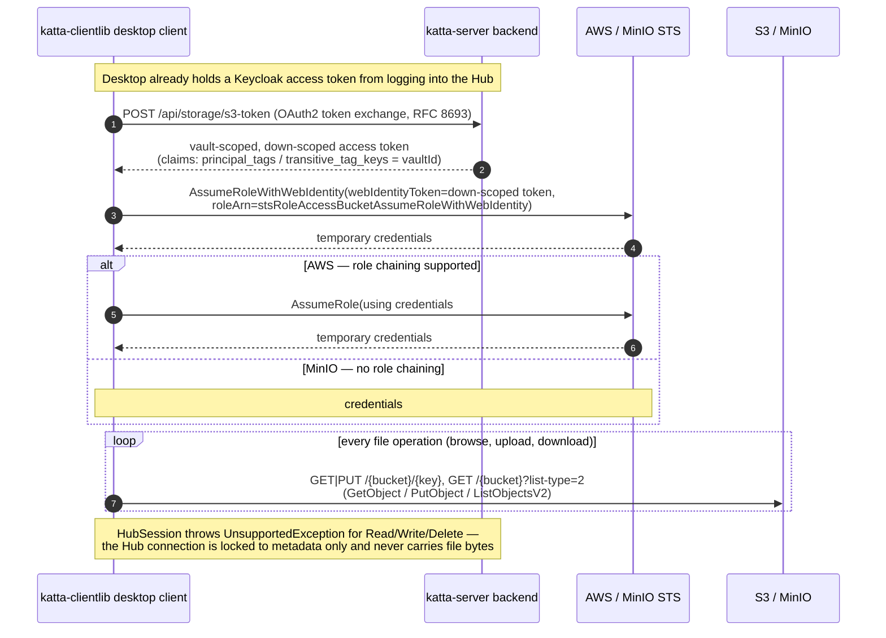
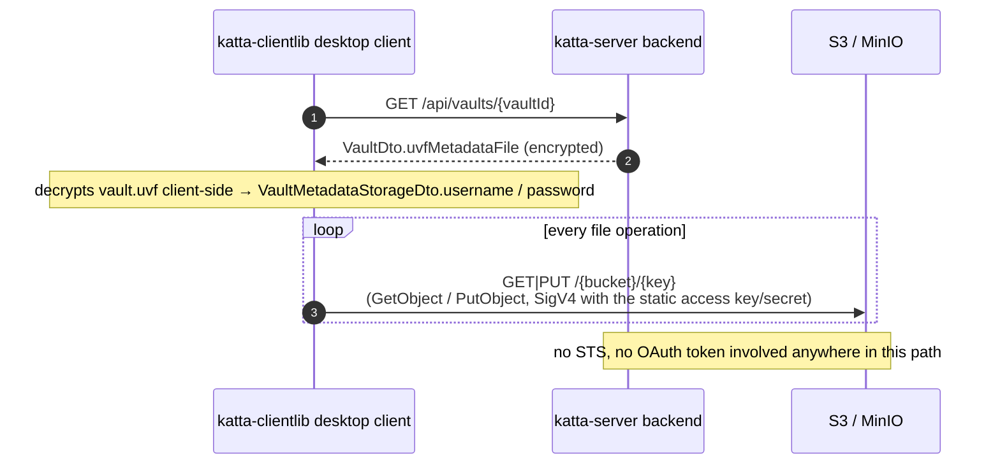

# S3 / STS Interactions

Which components of **katta-clientlib** (this repo) and **katta-server** ("Hub" — a separate repo, backend + web frontend) talk to S3 and STS APIs, and how.

> **Scope note.** katta-server is a separate repo ([shift7-ch/katta-server](https://github.com/shift7-ch/katta-server), verified at commit `1e50912`) — a
> monorepo containing both the Java/Quarkus `backend/` and the Vue 3 `frontend/`. Everything below has been read directly from source in both repos, not
> inferred.

> [!CAUTION]
> AI-generated content, manually skimmed.

## Contents

- **Setup**
    - [1. Setup — provisioning IAM roles and registering a storage profile](#1-setup--provisioning-iam-roles-and-registering-a-storage-profile)
- **Vault creation**
    - *S3-STS profile*
        - [2. Vault creation — desktop client (S3-STS profile)](#2-vault-creation--desktop-client-s3-sts-profile)
        - [3. Vault creation — Hub web frontend (S3-STS profile)](#3-vault-creation--hub-web-frontend-s3-sts-profile)
    - *S3STATIC profile*
        - [4. Vault creation — desktop client (S3STATIC profile)](#4-vault-creation--desktop-client-s3static-profile)
        - [5. Vault creation — Hub web frontend (S3STATIC profile)](#5-vault-creation--hub-web-frontend-s3static-profile)
- **Vault unlock & day-to-day access**
    - *S3-STS profile*
        - [6. Vault unlock and day-to-day file access — desktop client (S3-STS profile)](#6-vault-unlock-and-day-to-day-file-access--desktop-client-s3-sts-profile)
    - *S3STATIC profile*
        - [7. Vault unlock and day-to-day file access — desktop client (S3STATIC profile)](#7-vault-unlock-and-day-to-day-file-access--desktop-client-s3static-profile)

## Component summary

| Component                                       | Calls STS?                                                                                                                      | Calls S3 directly?                                                                     | Notes                                                                                                                                                                                                                      |
|-------------------------------------------------|---------------------------------------------------------------------------------------------------------------------------------|----------------------------------------------------------------------------------------|----------------------------------------------------------------------------------------------------------------------------------------------------------------------------------------------------------------------------|
| **Desktop client** (katta-clientlib, this repo) | Yes — `AssumeRoleWithWebIdentity`, plus AWS role-chaining `AssumeRole`                                                          | Yes — all bucket creation and every file read/write                                    | The only component that moves file bytes; see [`HubUVFVaultProvider`](hub/src/main/java/cloud/katta/protocols/hub/HubUVFVaultProvider.java), [`HubUVFVault`](hub/src/main/java/cloud/katta/protocols/hub/HubUVFVault.java) |
| **Hub backend** (katta-server)                  | No — only receives temp credentials the frontend forwards (see [section 3](#3-vault-creation--hub-web-frontend-s3-sts-profile)) | Only in the browser-assisted bucket-creation path, using credentials handed to it      | Its own Hub protocol session refuses Read/Write/Delete outright — metadata only                                                                                                                                            |
| **Hub web frontend** (katta-server, Vue 3)      | S3-STS only — `AssumeRoleWithWebIdentity(stsRoleCreateBucketHub)` in `CreateVault.vue`                                          | S3STATIC only — uploads `vault.uvf` straight to the bucket itself, no backend involved | Vault-creation only, for both profile types — has no file-browsing/read/download capability at all (no route, no `GetObjectCommand`/`DeleteObjectCommand` anywhere in `frontend/src`)                                      |
| **admin-cli** (this repo)                       | No — calls cloud IAM / MinIO admin APIs directly, not STS                                                                       | No                                                                                     | Setup-time only; provisions the roles/policies the other three actors later use                                                                                                                                            |
| Keycloak                                        | —                                                                                                                               | —                                                                                      | OIDC IdP; issues the access tokens used as STS web-identity tokens, and the Hub's down-scoped, vault-tagged exchange tokens                                                                                                |
| AWS STS / MinIO STS                             | —                                                                                                                               | —                                                                                      | Issues temporary credentials from `AssumeRoleWithWebIdentity` / `AssumeRole`                                                                                                                                               |
| S3 / MinIO                                      | —                                                                                                                               | —                                                                                      | The object store itself                                                                                                                                                                                                    |

## 1. Setup — provisioning IAM roles and registering a storage profile

`admin-cli` talks to AWS IAM or MinIO's admin API directly — never through the Hub — to create the STS trust chain, then separately registers the resulting role
ARNs with the Hub as a storage profile.

MinIO can't do AWS-style role chaining or session tagging, so it has only two roles/policies instead of three, and scopes per-vault access with the
`${jwt:client_id}` policy variable instead of a tagged session — see the `alt` branches above and the chained-access diagram below.

## 2. Vault creation — desktop client (S3-STS profile)

Creating a vault from the desktop client is entirely client-driven: it gets its own temporary credentials, creates the bucket, and uploads the initial encrypted
vault objects itself. The Hub backend is only told the resulting vault metadata — it never receives AWS credentials and never touches S3 here.

## 3. Vault creation — Hub web frontend (S3-STS profile)

`frontend/src/components/CreateVault.vue` calls `@aws-sdk/client-sts` itself to get temporary credentials, using the web identity token from the browser's own
Hub login session (`cryptomatorhub` OIDC client, not `cryptomatorvaults`) and an inline STS session policy scoping the result to `CreateBucket`/
`GetBucketPolicy` and a scoped `PutObject`. It then PUTs those credentials to the backend, which finishes the job across origins the browser's CORS restrictions
can't reach itself. The backend's current implementation (`StorageResource.createBucket` → `S3StorageHelper.makeS3Bucket`) sets **no bucket policy and no CORS
configuration** — despite the OpenAPI operation summary still saying "creates bucket and policy... for call from Web Client (CORS)" — object-level scoping comes
entirely from the frontend's own inline session policy above.

This is the *only* place the Hub backend touches S3 at all, and even then it's acting on temporary credentials someone else obtained — not its own identity.

## 4. Vault creation — desktop client (S3STATIC profile)

Unlike the web frontend (section 5), the desktop client isn't limited by browser CORS — so this flow *does* include a real `CreateBucket` call, just like the
S3-STS creation flow (section 2), except `HubUVFVaultProvider.create()`'s `case S3_STATIC` branch (`hub/src/main/java/cloud/katta/protocols/hub/HubUVFVaultProvider.java:105-128`)
obtains its S3 session from operator-entered static credentials instead of an STS-issued temporary session — the two flows share the same generic
`vault.create()`/`HubUVFVault.create()` bucket-provisioning code afterward. Two separate credential prompts occur: one for the access key/secret persisted
into the vault's `vault.uvf` metadata (used by every member for day-to-day access, per section 7), and one — potentially the same key pair, potentially not —
used once here to actually create the bucket.

There's also no per-vault Keycloak protocol-mapper step here, unlike section 2: `apiVaultsVaultIdPut`'s two AWS/MinIO configuration flags are both gated on
`storage.getHost().getProtocol().isRoleConfigurable()` (`HubUVFVaultProvider.java:188-189`), which is false for a `StorageProfileS3StaticDto`-backed session —
there's no role ARN to configure a trust policy for.

## 5. Vault creation — Hub web frontend (S3STATIC profile)

`StorageProfileS3StaticDto` carries no credential field at all (just `endpoint`, `region`, `bucketPrefix`, etc.) — so unlike an admin-shared secret, each vault
creator types their own access key, secret key, and target bucket name straight into the `CreateVault.vue` form. Two things make this path different from every
other diagram here:

- **No `CreateBucket` call anywhere.** The frontend only does a pre-flight `ListObjectsV2` (to confirm the bucket exists and is empty) and then two `PutObject`
  calls. The bucket itself must already exist, created out-of-band by whoever administers the S3 account.
- **The backend can't help even if asked.** `StorageResource.createBucket`'s handler only accepts `StorageProfileS3STS`; any other profile type — including
  `S3STATIC` — hits a `default` branch that throws `BadRequestException`. So there is no backend-assisted variant of this flow to fall back to.

Whichever profile type is used, this is as far as the web frontend's S3 involvement goes: it can create a vault, but **it has no file-browsing feature at all**.
`VaultDetails.vue` (the only per-vault screen) only manages metadata and access grants; there's no route, no `GetObjectCommand`, no `DeleteObjectCommand`
anywhere in `frontend/src`. Browsing, uploading, and downloading files is exclusively the desktop client's job (sections 6 and 7).

## 6. Vault unlock and day-to-day file access — desktop client (S3-STS profile)

Every open/browse/upload/download after the first unlock goes through this chained-credential dance, then talks to S3 directly. The Hub backend is consulted
once per token refresh (to down-scope a token to this one vault) and is otherwise completely out of the data path — confirmed by `HubUVFVault` delegating every
file-I/O feature to the live S3 session, while `HubSession`'s own Read/Write/Delete features explicitly throw `UnsupportedException`. The `principal_tags`/
`transitive_tag_keys` claim itself isn't built by the `/s3-token` endpoint on the fly — it's enforced by the per-vault Keycloak protocol mapper provisioned back
in section 2's `keycloakPrepareVault` step.

## 7. Vault unlock and day-to-day file access — desktop client (S3STATIC profile)

For `S3STATIC` storage profiles, S3 access keys are set once at vault-creation time and persisted (encrypted, member-to-member) inside the vault's own
`vault.uvf` metadata. No OAuth, no STS, no role ARNs — the Hub backend never sees the plaintext secret outside that opaque encrypted blob it stores.

## Sources

- `hub/src/main/java/cloud/katta/protocols/hub/HubUVFVaultProvider.java` — client-side create/load flows, S3-STS and S3-STATIC branches
- `hub/src/main/java/cloud/katta/protocols/hub/HubUVFVault.java` — delegates all file I/O to the S3 session, never the Hub session
- `hub/src/main/java/cloud/katta/protocols/hub/HubSession.java` — Read/Write/Delete features throw `UnsupportedException`
- `hub/src/main/java/cloud/katta/protocols/s3/STSChainedAssumeRoleRequestInterceptor.java` — token exchange + two-hop `AssumeRole` chaining
- `hub/src/main/resources/openapi.json` — `PUT /api/storage/{vaultId}`, `POST /api/storage/s3-token`, `StorageProfileS3STSDto` field docs
- `admin-cli/src/main/java/cloud/katta/cli/commands/storage/{aws/AWSSTSStorage,minio/MinIOSTSStorage}.java` — direct IAM/MinIO-admin provisioning
- `admin-cli/src/main/java/cloud/katta/cli/commands/hub/storageprofile/{aws,minio}/*STSStorageProfile.java` — storage profile registration
- `admin-cli/src/main/java/cloud/katta/cli/commands/common/Defaults.java` — the three OIDC client IDs and what each is for
- `test/src/test/resources/docker-compose-hub-keycloak-minio.yml` — full service inventory (confirms there is no separate frontend *container*; the `hub` image
  bundles backend + frontend assets from `katta-server`)

From [shift7-ch/katta-server](https://github.com/shift7-ch/katta-server) (commit `1e50912`):

- `backend/src/main/java/org/cryptomator/hub/api/katta/StorageResource.java` — `PUT /api/storage/{vaultId}` and `POST /api/storage/s3-token` handlers
- `backend/src/main/java/org/cryptomator/hub/api/katta/storage/S3StorageHelper.java` — the backend's only S3 SDK usage anywhere (`CreateBucket` + three
  `PutObject` calls, no bucket policy, no CORS)
- `backend/src/main/java/org/cryptomator/hub/katta/KeycloakCryptomatorVaultsHelper.java` — per-vault protocol mapper setup (`awsProtocolMapper`/
  `minioProtocolMapper`), invoked from `VaultResource.java:757`
- `backend/src/main/java/org/cryptomator/hub/api/katta/StorageProfileResource.java`, `StorageProfileS3STSDto.java` — `POST /api/storageprofile` and the STS
  role-ARN field names
- `frontend/src/components/CreateVault.vue` — S3-STS `AssumeRoleWithWebIdentity` call via `@aws-sdk/client-sts`; S3STATIC's direct `@aws-sdk/client-s3` upload
  and `corsConfigurationHint()`
- `frontend/src/common/auth.ts`, `chart/values.yaml` — confirms the frontend's web-identity token comes from the `cryptomatorhub` Keycloak client
- `backend/src/main/java/org/cryptomator/hub/api/katta/StorageProfileS3StaticDto.java`, `entities/katta/StorageProfileS3Static.java` — confirms no shared
  credential field exists on the static profile
- `frontend/src/components/VaultDetails.vue`, `frontend/src/router/index.ts` — confirms no file-browsing route or S3 read/delete calls exist in the frontend
