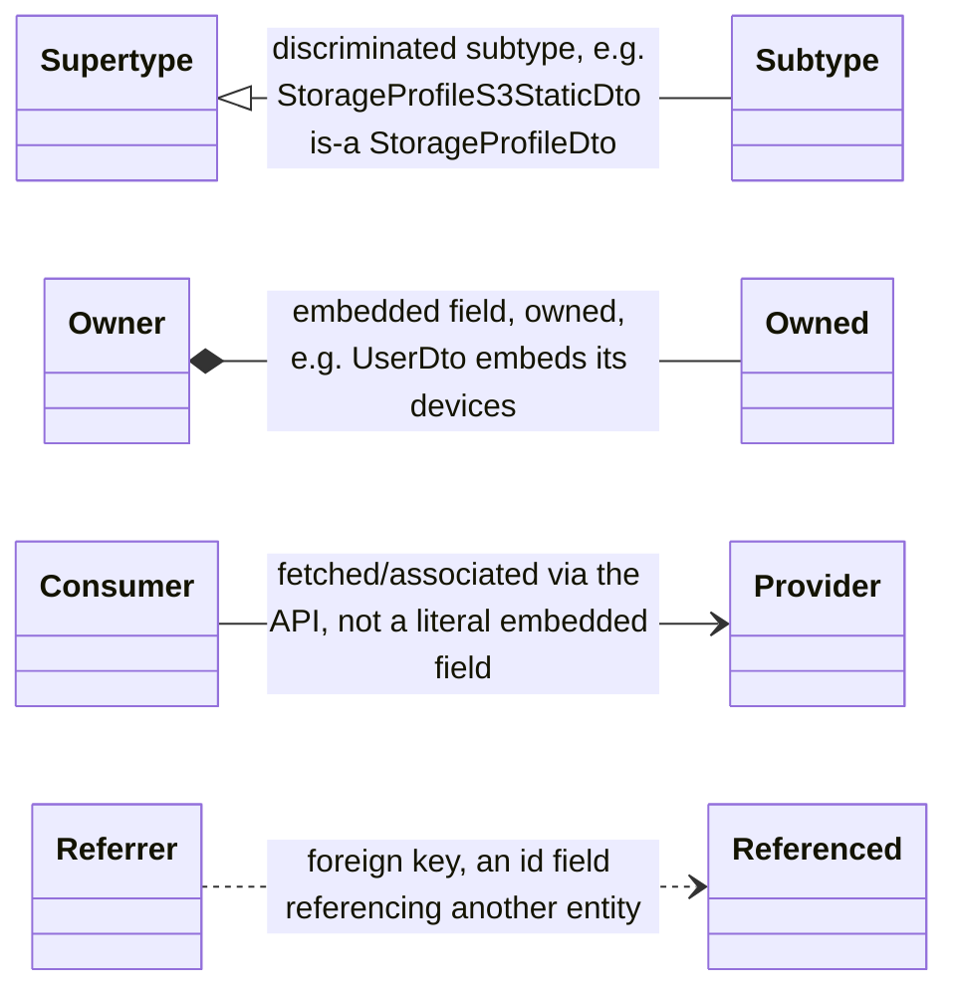
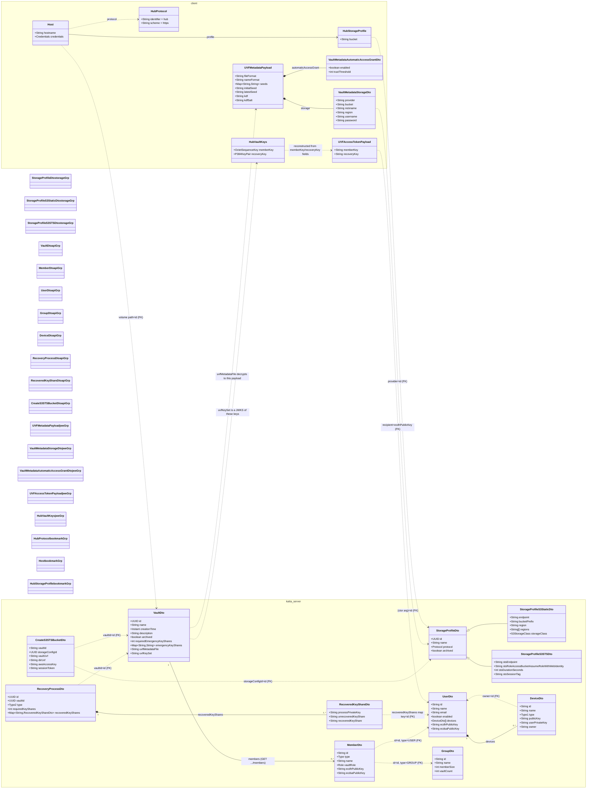

# Vault Data Model

Schema reference for `katta-clientlib` (hub module). Traces foreign-key relationships across four domains that are modeled separately in the codebase but share
IDs: **storage profiles**, the **/vault API**, the **vault.uvf JWE metadata**, and the **Hub bookmark** (a runtime Cyberduck construct, not a persisted entity).

> [!CAUTION]
> AI-generated content, manually skimmed.

## Scope

- **Storage profiles** (`StorageProfileDto`) — admin-configured S3 backends (static credentials or STS), discriminated by `protocol`.
- **/vault API** — `VaultDto` and the users, devices, groups, and recovery entities around it, from `hub/src/main/resources/openapi.json`.
- **vault.uvf JWE metadata** — the encrypted payload (`UVFMetadataPayload`) living inside `VaultDto.uvfMetadataFile`, from `cloud.katta.crypto.uvf.*`.
- **Hub bookmark** — the Cyberduck `Host`/`Profile` pair assembled at connection time from the other three (`cloud.katta.protocols.hub.*`); not stored on the
  server.

## Legend

Color groups in the diagram: storage profile, /vault API entity, vault.uvf JWE metadata, Hub bookmark (runtime) — see the `classDef` fill colors on the diagram below.

## Diagram

Classes are grouped into two namespaces by where they're defined: `katta_server` for every schema declared in `hub/src/main/resources/openapi.json`, and
`client` for types that exist only in this client library — decrypted JWE payloads, key material, and the runtime Cyberduck bookmark. Fill color still marks the
four conceptual domains from the Legend above.

## Foreign keys, at a glance

| Source                                        | Field             | Target                        | Note                                                                                                       |
|-----------------------------------------------|-------------------|-------------------------------|------------------------------------------------------------------------------------------------------------|
| `VaultMetadataStorageDto`                     | `provider`        | `StorageProfileDto.id`        | Set at vault creation from the chosen profile; only visible after decrypting `vault.uvf`.                  |
| `CreateS3STSBucketDto`                        | `storageConfigId` | `StorageProfileDto.id`        | Same FK, plaintext this time — sent to `PUT /api/storage/{vaultId}` when provisioning the bucket.          |
| `HubStorageProfile`                           | (constructor arg) | `StorageProfileDto.id`        | The bookmark's connection profile is built directly from a `StorageProfileDtoWrapper`.                     |
| `CreateS3STSBucketDto` / `RecoveryProcessDto` | `vaultId`         | `VaultDto.id`                 | Also the path parameter on nearly every `/api/vaults/{vaultId}/...` route.                                 |
| `Host`                                        | volume path       | `VaultDto.id`                 | The bucket object path is `bucketPrefix + vaultId`; the bookmark's root volume encodes it.                 |
| `MemberDto` / `AuthorityDto`                  | `id` (+ `type`)   | `UserDto.id` or `GroupDto.id` | Polymorphic FK — `type` discriminates which table the id belongs to.                                       |
| `DeviceDto`                                   | `owner`           | `UserDto.id`                  | Also the path param in the deprecated `GET /vaults/{vaultId}/keys/{deviceId}`.                             |
| `UVFAccessTokenPayload`                       | JWE recipient     | `UserDto.ecdhPublicKey`       | Delivered per-user via `/vaults/{vaultId}/access-token(s)`, encrypted so only that key holder can open it. |
| `RecoveryProcessDto`                          | `vaultId`         | `VaultDto.id`                 | Emergency-access process; `recoveredKeyShares` map keys are authority ids (FK to User/Group).              |

## Simplifications

- **Hub bookmark isn't a server entity.** `Host` + `HubStorageProfile` is a Cyberduck runtime construct assembled in `HubUVFVaultProvider.create()`/`.load()` —
  nothing here is persisted on the Hub server.
- **`AuthorityDto`** (`oneOf` `UserDto` \| `GroupDto` \| `MemberDto`, discriminated by `type`) is collapsed into direct edges to `UserDto`/`GroupDto` for
  legibility.
- Legacy pre-UVF fields on `VaultDto` (`masterkey`, `iterations`, `salt`, `authPublicKey`, `authPrivateKey`) and the read-only list projection
  `VaultDtoWithRole` are omitted — they don't carry new foreign keys.
- Field lists are trimmed to identifying and FK-bearing attributes; see `hub/src/main/resources/openapi.json` for the full OpenAPI schemas.

---
Sources: `hub/src/main/resources/openapi.json` · `cloud.katta.crypto.uvf.*` · `cloud.katta.protocols.hub.*`
